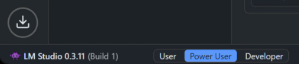
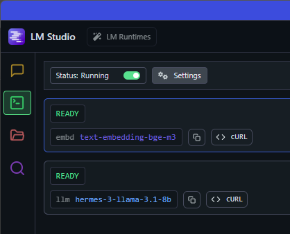

# Document QA Assistant

A **Document QA Assistant** is a Streamlit-based web application backed by a Flask API that answers user questions by retrieving and synthesizing information from a private document corpus. It supports two inference backends:

1. **Azure OpenAI**: Inference engine via Azure OpenAI Service.
2. **LM Studio (Local LLM)**: Locally hosted LM Studio API.

---

## 🔧 Prerequisites

* **Python 3.9+**
* **Git**
* **Azure Subscription** with:

  * Azure OpenAI resource (endpoint & key)
* **LM Studio** running locally (for local usage)

---

## 📦 Installation

### 1. Clone the repository:

   ```bash
       git clone https://github.com/your-org/document-qa-assistant.git
       cd document-qa-assistant
   ```

### 2. Create and activate a virtual environment:

Windows:
   ```bash
       python -m venv .venv
       .\.venv\\Scripts\\activate
   ```
Mac/Linux:
   ```bash
       python -m venv .venv
       source .venv/bin/activate
   ```

### 3. Install Python dependencies:

   ```bash
       pip install --upgrade pip
       pip install -r requirements.txt
   ```

### (_Optional_) 4. Reinstall torch for local use
Uninstall torch 
```bash
       pip uninstall torch
   ```
and install it via instructions in 
this link for your hardware
https://pytorch.org/get-started/locally/ 
if you plan on using the app locally with your GPU support

---

## 🛠️ Configuration

### Set these environment variables:

```bash
# Azure OpenAI settings
ENDPOINT_URL=https://<your-resource>.cognitiveservices.azure.com/
DEPLOYMENT_NAME=<your-deployment>
API_VERSION=<your-version>
AZURE_OPENAI_API_KEY=<your-key>
DEPLOYMENT_EMB=<your-deployment>
API_VERSION_EMB=<your-version>

# Local LM Studio settings
MODEL_URL=http://localhost:1234
MODEL_NAME=<your-preffered-local-model>

# Your document directory for retrieval (absolute or relative)
DOCS_DIR=<your-docs-path>
```

The application will automatically pick up these environment variables via `config.py`.

### Set up the reranker
If you intend to improve performance via a reranker model 
and not use the local implementation, 
edit the code as explained in `config.py`, based on which reranker you use

### Run this for local use via LM Studio
```bash
  LOCAL=True
```
---

## 🚀 Running the App

### 1. **Generate embeddings** (only needed on first run or when documents change):

   ```bash
      python main.py  # Embeddings will be created and stored in ./chroma_db
   ```

### 2. **Start the Streamlit UI**:

   ```bash
      streamlit run query_ui.py
   ```

### 3. Open your browser at `http://localhost:8501` to interact with the Document QA Assistant.

---


## 🔄 Local use: LM Studio API

If Azure OpenAI is unavailable, or if you prefer a local inference engine, configure the LM Studio API.

### 1. Run LM Studio locally and expose its OpenAI-compatible endpoint:

   * you can install LM Studio at https://lmstudio.ai/
   * enable Power User options in the bottom left corner


   * download the models you want to use through the app and start the local server under the **Developer** tab


> *The `config.py` logic will route calls to the LM Studio via localhost:1234. Change `MODEL_URL` if you need a different port.*

---
## 📂 Project Structure

```
├── query_ui.py        # Streamlit front-end
├── main.py            # Flask API server with endpoints
├── text_processing.py # Markdown & HTML splitting utilities
├── database.py        # Document indexing & retrieval logic
├── config.py          # Configuration & client initialization
├── tests.py           # Testing file for RAGAS evaluation on your dataset
├── requirements.txt   # Python dependencies
└── docs/              # Your markdown documents for QA
```
---
